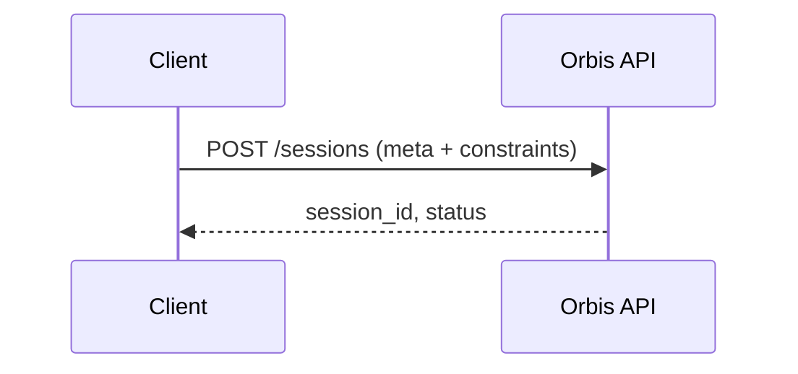
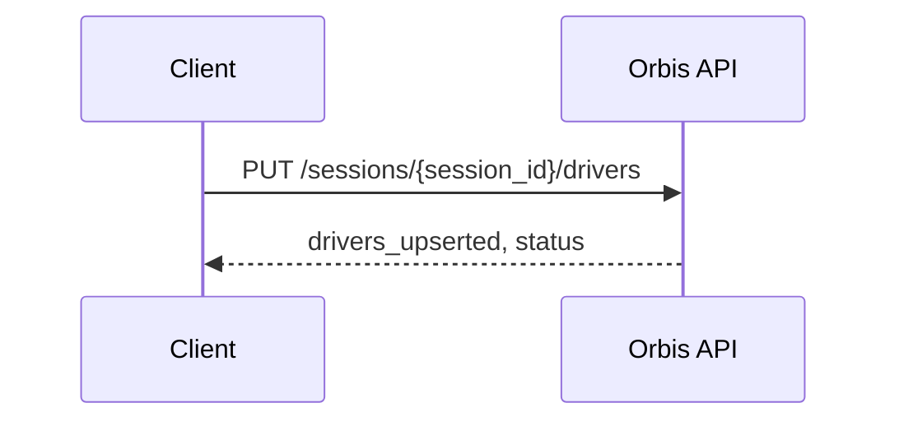
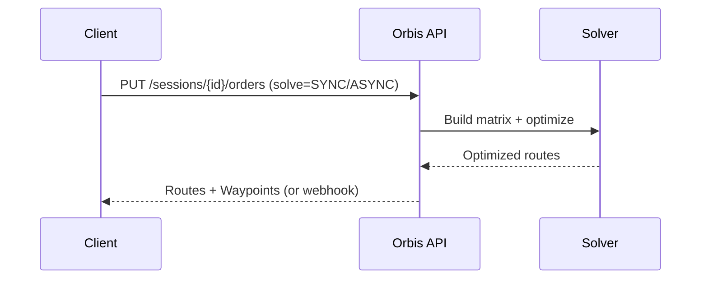
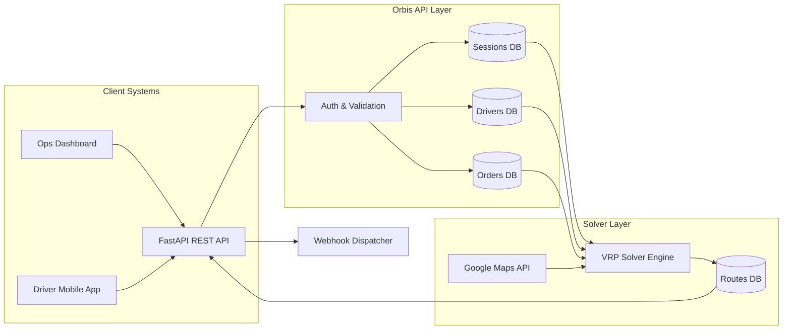
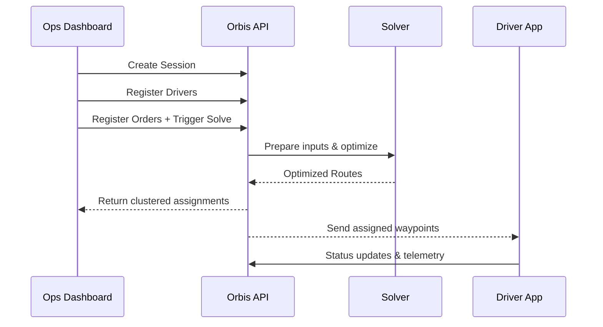

# Orbis — Vehicle Routing Optimization System

> Multi-step API flow to register constraints, drivers, and orders, then produce optimized delivery routes with real-world constraints.

---

## 📌 Overview
Orbis solves the **Vehicle Routing Problem (VRP)** with:
- Multiple vehicle classes (2W, vans, trucks, pickups).
- Constraints: driver shifts, lunch breaks, cash/value limits, range limits, capacity.
- Time window compliance.
- Google Maps API integration for accurate distance/time matrices.
- Driver-app-ready route outputs.

---

## 🛠 High-Level Workflow

```mermaid
flowchart TD
    A[Client] -->|1. Create Session| B(POST /sessions)
    B -->|Returns session_id| C[Client]
    C -->|2. Register Drivers| D(PUT /sessions/{id}/drivers)
    D --> E[Client]
    E -->|3. Register Orders| F(PUT /sessions/{id}/orders)
    F -->|Trigger Solve| G[Solver Engine]
    G -->|Optimized Routes| H[Orbis API]
    H -->|Return Routes + Waypoints| I[Client & Driver App]
```

---

## 📂 API Endpoints & Flow

### Step 1 — Handshake / Create Session

**Input:** Depot, vehicle classes, global constraints, objectives, distance matrix config.  
**Output:** `session_id` for linking all future calls.

---

### Step 2 — Register Drivers

**Input:** Driver ID, vehicle class, shift, breaks, capacity, cash/value limits.  
**Output:** Confirmation of upserted drivers.

---

### Step 3 — Register Orders & Trigger Solve

**Input:** Order location, time windows, demand, payment/value, required vehicle classes.  
**Output:** Optimized driver routes with sequenced waypoints and ETAs.

---

## 📦 Input Examples (Simplified)

### Create Session
```json
{
  "planning_date": "2025-08-12",
  "depot": { "id": "dc_blr_1", "location": { "lat": 12.9716, "lng": 77.5946 } },
  "vehicle_classes": [
    { "code": "2W", "capacity": { "weight": 25, "volume": 50 }, "range_km": 80 }
  ],
  "global_policies": { "variant": "VRPTW" },
  "distance_matrix": { "provider": "GOOGLE_MAPS", "travel_mode": "DRIVING" }
}
```

---

## 📤 Output Example (Product View)

### Solve Response (SYNC)
```json
{
  "run_id": "run_01HZYB4P4V4K",
  "status": "SOLVED",
  "summary": { "orders_total": 10, "routes": 3, "distance_km": 142.3 },
  "routes": [
    {
      "driver_id": "drv_2w_01",
      "route_stats": { "stops": 5, "distance_km": 42.1 },
      "waypoints": [
        { "type": "START", "eta": "2025-08-12T08:00:00+05:30" },
        { "type": "DELIVERY", "order_id": "ORD-1001", "eta": "2025-08-12T10:50:00+05:30" },
        { "type": "END", "eta": "2025-08-12T15:40:00+05:30" }
      ]
    }
  ]
}
```

---

## 🏗 System Architecture



---

## 📈 Data Flow



---

## 📋 Summary of Inputs/Outputs

| Step        | Input                                           | Output                                         |
|-------------|------------------------------------------------|------------------------------------------------|
| **1. Handshake** | Depot, vehicle classes, constraints, objective | `session_id`                                   |
| **2. Drivers**   | Driver profiles, shifts, breaks, limits        | Confirmation of drivers upserted              |
| **3. Orders**    | Order details, time windows, demands           | Optimized routes with waypoints                |
| **Solve Result** | —                                              | Summary + per-driver waypoints (ETAs, capacities) |

---

## 🚀 Next Steps for Development
1. **Backend** — Build endpoints for sessions, drivers, orders, solves.
2. **Solver** — Integrate OR-Tools or hybrid solver.
3. **Matrix** — Connect to Google Maps Distance Matrix API.
4. **Webhook** — Implement async notifications.
5. **Driver App** — Fetch routes & update waypoint status.
6. **Testing** — Validate constraint handling & performance.

---
